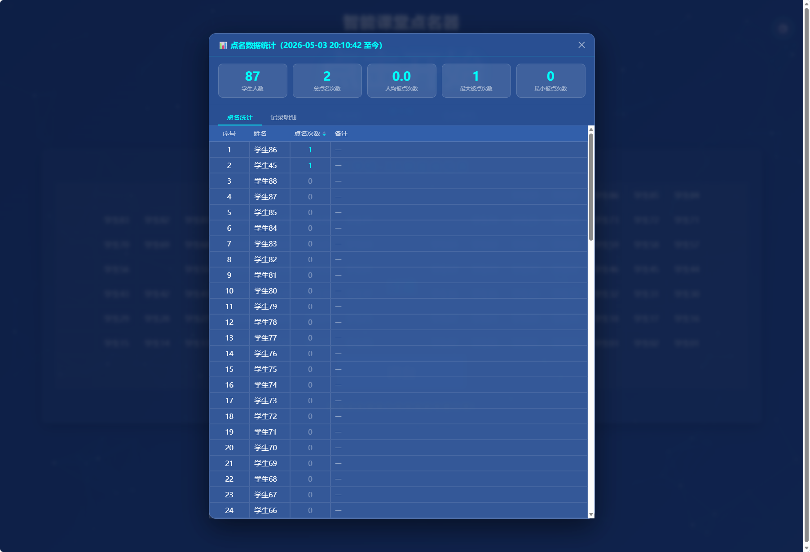
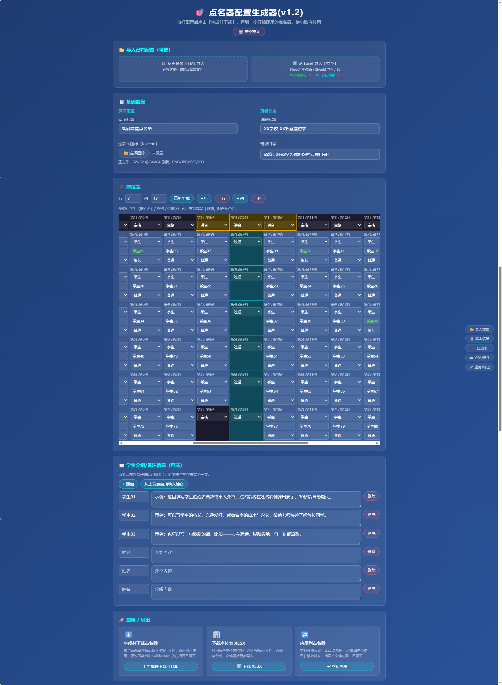

# 🎯 智能课堂点名器 v1.2

一个开箱即用的课堂点名工具，纯原生 HTML 单文件，无需安装任何依赖，双击即可使用。






## ✨ 功能特性

- **均衡抽取** — 优先从被点次数最少的同学中随机抽取，保证机会均等；本轮全部点完后自动进入下一轮并弹出提示
- **全员随机** — 不考虑被点次数，每次从全班完全随机抽取，适合需要重复点名的场景
- **手动点名** — 双击座位直接标记/取消点名，右键座位可查看或编辑学生介绍
- **座位高亮** — 点名后对应座位实时高亮，全班一目了然
- **被点次数** — 可开启座位右上角折角角标，显示每位学生的累计被点次数
- **点名统计** — 查看每位学生被点次数、总次数、人均/最大/最小被点次数，支持排序，含备注列
- **视角切换** — 支持教师视角与学生视角（180° 翻转）双向切换
- **双主题** — 内置深蓝 / 暗黑两套主题，切换状态自动保存
- **班委标识** — 红色下划线标注班长，绿色下划线标注组长
- **学生介绍** — 点名后可在姓名旁弹出学生介绍卡片，20 秒后自动消失
- **被点次数角标** — 可开启座位右上角折角角标，显示每位学生的累计被点次数
- **点名记录导入/导出** — 支持将点名数据导出为 Excel 文件存档，可从导出文件恢复，方便跨设备迁移
- **一键清空记录** — 清除本轮所有点名记录
- **数据持久化** — 所有点名记录与设置自动保存至浏览器本地，刷新不丢失
- **粒子背景** — 动态粒子特效

## 🛠️ 配置生成器

提供 `builder.html` 配置生成器，无需修改代码即可完成所有配置：

- **可视化编辑座位表** — 支持自定义行列数、学生姓名、班委角色、过道/讲台位置
- **导入 / 导出** — 支持从已有点名器 HTML 或 Excel 文件导入配置，支持导出 XLSX
- **学生介绍编辑** — 在线编辑每位学生的介绍文字，也可通过右键菜单直接在点名器中编辑
- **网页参数配置** — 支持自定义网页标题（浏览器标签页名称）和选项卡图标（favicon）
- **班级信息配置** — 支持配置班级标题和班级口号
- **草稿自动保存** — 编辑内容自动保存到浏览器，刷新不丢失
- **应用到点名器** — 从点名器菜单跳转到生成器编辑后，可直接应用回点名器无需重新生成

## 🚀 快速开始

1. 下载 `index.html` 和 `builder.html`，放到同一目录
2. 用浏览器打开 `builder.html` 配置座位表
3. 点击「生成并下载点名器 HTML」
4. 双击下载的 HTML 文件开始点名

> 无需服务器，无需网络（粒子背景除外），本地直接运行。

## 📁 项目结构

```
index.html      # 点名器主文件
builder.html    # 配置生成器
images/         # 预览图片
```

## 🌐 在线预览

https://helloaider.github.io/smart-roll-call/

## 📋 更新日志

### v1.2
- 新增点名记录导入/导出：支持将点名数据导出为 Excel 文件存档，并可从导出文件恢复，方便跨设备迁移
- 随机点名模式重构：「仅抽未点过」升级为「均衡抽取」，优先从被点次数最少的同学中抽取，保证机会均等；本轮全部点完后自动进入下一轮并弹出提示
- 新增座位折角角标：可开启后在座位右上角显示每位学生的累计被点次数，次数越多颜色越深
- 新增右键菜单：右键座位可快速查看或编辑该学生的介绍/备注
- 新增点名统计弹框：显示每位学生被点次数、总次数、人均/最大/最小被点次数
- 统计列表支持按被点次数、点名时间排序，含备注信息列
- 统计数据仅统计当前学生，自动排除历史旧记录
- 新增网页标题可配置（浏览器标签页显示名称）
- builder 基础信息区重构：左侧页面配置（网页标题、favicon），右侧班级信息（班级标题、口号）
- 班级口号配置移至基础信息区，与班级标题统一管理
- 修复点名统计弹框列表滚动时数据穿透标题栏的问题
- 修复最大/最小被点次数统计错误（现基于全体学生含0次）
- 版权信息下移，使用说明更新至 v1.2

### v1.1
- 新增 `builder.html` 可视化配置生成器
- 支持从 Excel / HTML 导入座位配置
- 支持导出座位表及学生介绍 XLSX
- 座位数据改为学生视角存储，渲染时自动转换为教师视角
- 支持从点名器菜单直接跳转编辑并应用配置
- 修复过道合并、列宽等显示问题

### v1.0
- 初始开源版本
- 支持随机点名、手动点名、视角切换、双主题、班委标识、学生介绍、记录管理

## 📄 License

[MIT](./LICENSE)

## 📬 联系作者

如有任何使用问题或新需求，欢迎通过邮箱联系作者：20597475@qq.com
