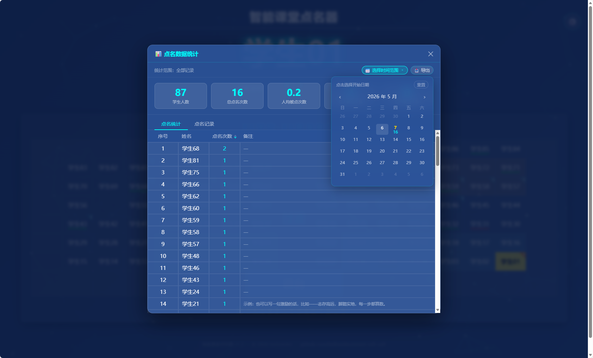
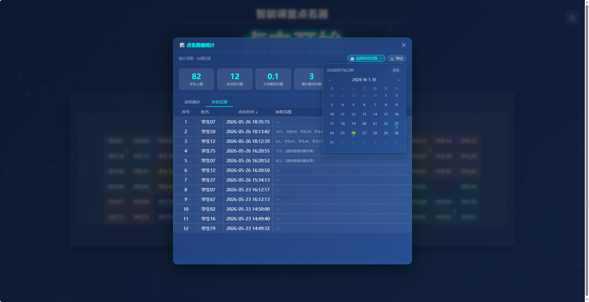
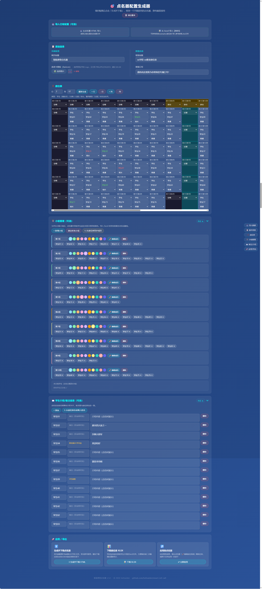

# 🎯 智能课堂点名器 v1.6

一个开箱即用的课堂点名工具，纯原生 HTML 单文件，无需安装任何依赖，双击即可使用。







## ✨ 功能特性

- **均衡抽取** — 优先从被点次数最少的同学中随机抽取，保证机会均等；本轮全部点完后自动进入下一轮并弹出提示
- **全员随机** — 不考虑被点次数，每次从全班完全随机抽取，适合需要重复点名的场景
- **随机抽小组** — 从所有小组中随机抽取一组，抽中后高亮该组全部座位并展示成员名单
- **组内随机抽** — 选定小组后从组内成员中随机抽取一人，计入点名记录，显示剩余未点人数
- **指定名单抽人** — 手动输入任意名单（支持换行/逗号分隔），从中随机抽取，名单内学生在座位表中存在时自动高亮
- **手动点名** — 双击座位直接标记/取消点名，右键座位可查看或编辑学生介绍
- **座位高亮** — 点名后对应座位实时高亮，全班一目了然
- **被点次数** — 可开启座位右上角折角角标，显示每位学生的累计被点次数，次数越多颜色越深
- **点名统计** — 支持按日期范围筛选（日历选择器，格子上显示每天点名次数），查看每位学生被点次数、总次数、人均/最大/最小被点次数，支持排序，含备注列
- **统计导出** — 在统计页面可导出当前筛选范围内的数据为 Excel，含点名统计和点名记录两个 Sheet，点名记录含「抽取范围」列，标题行自动合并居中
- **抽取范围追踪** — 每条随机点名记录自动保存本次候选人名单，统计页「点名记录」可查看并悬停展示完整名单，方便核查随机公平性；导出 Excel 时同步包含抽取范围数据
- **视角切换** — 支持教师视角与学生视角（180° 翻转）双向切换
- **班委标识** — 红色下划线标注班长，绿色下划线标注组长
- **小组背景色** — 支持为学生分组并设置背景色，颜色区分度高，可随时开关
- **学生介绍** — 点名后在姓名旁弹出介绍卡片，支持文字介绍和学生照片，20秒后自动消失；有照片时可点击放大查看
- **学生备注** — 可为每位学生添加仅老师可见的备注，座位左上角显示红点提示，备注内容在点名统计和导出Excel中同步展示
- **点名记录导入/导出** — 支持将点名数据导出为Excel文件存档，可从导出文件恢复，方便跨设备迁移；导入时自动识别并提示不在当前座位表中的姓名
- **一键清空记录** — 清除本轮所有点名记录
- **数据持久化** — 所有点名记录与设置自动保存至浏览器本地，刷新不丢失
- **粒子背景** — 动态粒子特效

## 🛠️ 配置生成器

提供`builder.html`配置生成器，无需修改代码即可完成所有配置：

- **可视化编辑座位表** — 支持自定义行列数、学生姓名、班委角色、过道/讲台位置
- **小组管理** — 支持创建小组、分配成员、设置背景色，10 种预设颜色色相差异明显
- **导入/导出** — 支持从已有点名器 HTML 或 Excel 文件导入配置，支持导出 XLSX（含小组背景色）
- **学生备注/介绍编辑** — 在线编辑每位学生的备注/介绍文字，也可通过右键菜单直接在点名器中编辑
- **网页参数配置** — 支持自定义网页标题（浏览器标签页名称）和选项卡图标（favicon）
- **班级信息配置** — 支持配置班级标题和班级口号
- **草稿自动保存** — 编辑内容自动保存到浏览器，刷新不丢失
- **应用到点名器** — 从点名器菜单跳转到生成器编辑后，可直接应用回点名器无需重新生成

## 🚀 快速开始

1. 下载`index.html`和`builder.html`，放到同一目录
2. 用浏览器打开`builder.html`配置座位表
3. 点击「生成并下载点名器HTML」
4. 双击下载的HTML文件开始点名

> 无需服务器，无需网络（导入导出表格除外），本地直接运行。

## 📁 项目结构

```
index.html        # 点名器主文件
builder.html      # 配置生成器
docs/             # 需求与设计文档
readme_images/    # README 预览截图
student_photos/   # 学生照片（文件名与学生姓名对应，如 张三.jpg）
examples/         # 示例表格（座位表、点名记录导入参考）
```

## 🌐 在线预览

https://helloaider.github.io/smart-roll-call/

## 📋 更新日志

### v1.6
- 新增抽取范围追踪：均衡抽取、全员随机、组内随机抽、指定名单抽人时，自动记录本次参与随机的候选人名单
- 统计页「点名记录」新增「抽取范围」列，显示候选人数量摘要，悬停查看完整名单，方便核查随机公平性
- 导出 Excel 的点名记录 Sheet 同步包含「抽取范围」列，导入时向后兼容旧格式

### v1.5
- 新增随机抽小组：从所有小组中随机抽取一组，抽中后高亮该组全部座位并展示成员名单
- 新增组内随机抽：选定小组后从组内成员中随机抽取一人，计入点名记录，显示剩余未点人数
- 新增指定名单抽人：手动输入任意名单，从中随机抽取，名单内学生在座位表中存在时自动高亮

### v1.4
- 学生介绍支持照片显示：将照片放入`student_photos/`目录，文件名与学生姓名一致即可自动匹配，支持jpg/png/webp/gif等格式
- 介绍卡片升级为图文混排：有照片时左图右文布局，纯文字或纯图片时自动适配，文字超出高度可滚动
- 新增介绍卡片放大功能：有照片时卡片右上角出现放大按钮，点击后居中放大显示，再次点击还原
- 新增学生备注功能：可为每位学生添加仅老师可见的备注，座位左上角红点提示，备注内容在点名统计和导出 Excel 中同步展示
- 规范项目目录结构：新增`student_photos/`、`examples/`目录，各类文件职责更清晰
- 显示偏好配置弹窗优化：字号、行间距与设置面板对齐，选项左对齐，底部按钮样式修复

### v1.3
- 新增点名统计时间范围筛选：统计页面新增日历选择器，可按日期范围筛选统计数据，日历格子上显示每天的点名次数
- 新增统计页面导出：可将当前筛选范围内的统计数据导出为Excel，含「点名统计」和「点名记录」两个Sheet，标题行自动合并居中加粗
- 导出 Excel 统一优化：标题行、时间行自动合并居中，新增导出时间信息
- 导入点名记录增强：导入时自动识别并提示不在当前座位表中的姓名和条数
- 修复编辑座位信息时小组颜色未正确传递的问题
- 修复从Excel导入座位表时Office主题色无法识别的问题
- 小组预设颜色优化：提升相邻小组的颜色区分度

### v1.2
- 新增点名记录导入/导出，支持跨设备迁移
- 随机点名重构为「均衡抽取」，优先从被点次数最少的同学中抽取，本轮结束后自动进入下一轮
- 新增座位折角角标，显示累计被点次数
- 新增右键菜单，可快速查看或编辑学生介绍
- 新增点名统计弹框，支持排序
- 新增网页标题可配置
- 修复统计列表滚动穿透、最大/最小次数统计错误等问题

### v1.1
- 新增`builder.html`可视化配置生成器
- 支持从Excel/HTML 导入座位配置，支持导出XLSX
- 支持从点名器菜单直接跳转编辑并应用配置
- 修复过道合并、列宽等显示问题

### v1.0
- 初始开源版本
- 支持随机点名、手动点名、视角切换、双主题、班委标识、学生介绍、记录管理

## 📄 License

[MIT](./LICENSE)

## 📬 联系作者

如有任何使用问题或新需求，欢迎通过邮箱联系作者：20597475@qq.com
